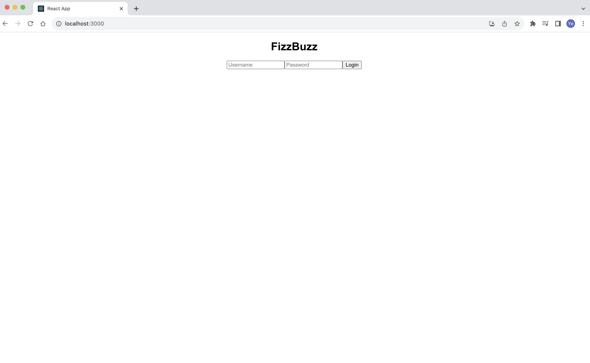

# FizzBuzz Web App

This is a simple web application that prints the numbers from 1 to 100 according to the FizzBuzz rules (demo for software enigneer interview take-home project). It replaces multiples of 3 with "Fizz," multiples of 5 with "Buzz," and multiples of both 3 and 5 with "FizzBuzz."; further system design about OWASP in description.

- **Tech Stack**:
  - Frontend: React
  - Backend: Flask
  - Authentication: JWT Integration
  - CI/CD: Docker-based workflow
  - Version Control: Git for recording milestones

## Getting Started

To run this project, you have two options:

1. Run the project using Docker Compose.
2. Run the project using Python and React (without Docker).

Please choose the method that suits your preference and environment.

### Option 1: Docker compose (preferred)

#### Prerequisites

Make sure you have the following installed on your system:

- Docker and Docker Compose installed on your system.

#### Run the Application

1. Open a terminal and navigate to the root directory of the project (where the docker-compose.yml file is located).

2. Run the following command to build and start the Docker containers:

```bash
docker-compose up
```

The frontend will be accessible at http://localhost:3000.

### Option 2: Python and React (without Docker)

#### Prerequisites

Make sure you have the following installed on your system:

- Node.js
- npm
- Python (version 3.x)

#### Backend Setup

1. Open a terminal and navigate to the root directory of the project.
2. Install backend dependencies:

```bash
pip install flask
```

```bash
pip install flask-cors
```

```bash
pip install pyjwt
```

3. Start the Python backend API:

The backend API will be running at http://127.0.0.1:8080/fizzbuzz

PS. Not accessible if not using token.

#### Frontend Setup

1. Open another terminal and navigate to the `frontend` directory.
2. Install frontend dependencies:

```bash
npm install
```

```bash
npm install axios
```

3. Start the React development server:

```bash
npm start
```
The frontend will be running at http://localhost:3000.

#### Login info

For simplicity, default username is 'user' while password is 'password' || if using others would fail to login.

PS. Default setting in Line 12-14 in /backend/app.py.

#### OWASP top 10 related answer
1. Authentication and Authorization
In the final version of project, JWT (JSON Web Tokens) is implemented in the backend code for authentication, which allows secure token-based authentication, enabling users to access protected resources only if they provide a valid token; in a larger-scale production project, more robust authentication system like OAuth or OpenID Connect should be considered. 

2. Input Validation:

Validating and sanitizing user input to prevent injection attacks and malicious data uploads. In a larger-scale project, implement input validation using secure libraries or frameworks to handle various input sources, such as forms, query parameters, and request bodies.

3. Secure Password Handling:

Store passwords securely by using strong hashing algorithms like bcrypt and salting.
In a larger-scale project, consider implementing multi-factor authentication (MFA) for an additional layer of security.

#### Login page



#### Demo page


